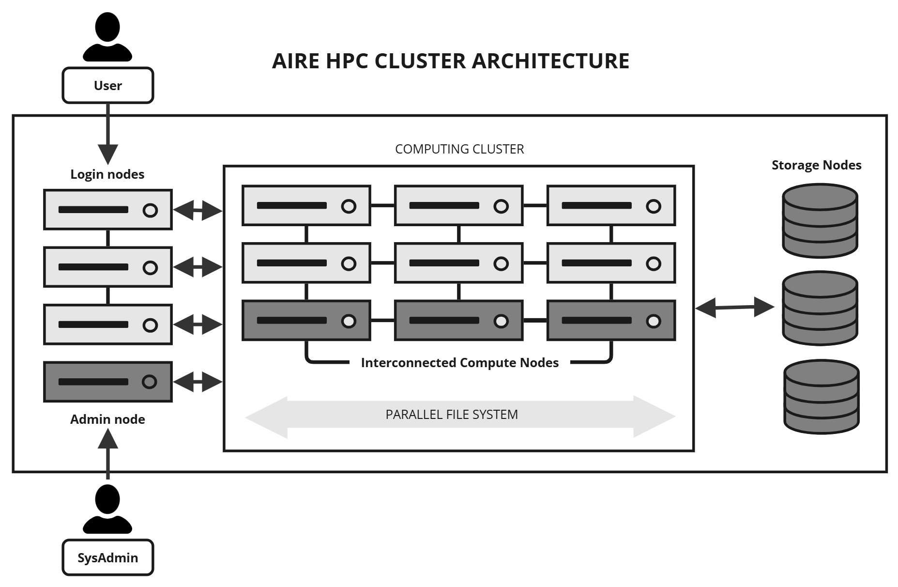
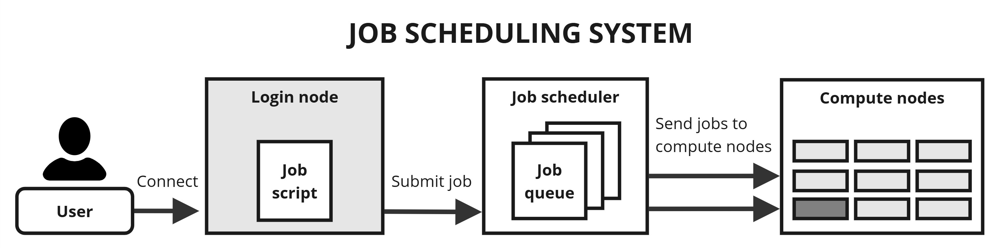

# HPC architecture

This page covers the basic things you need to know about the cluster architecture.

<!-- ```{contents}
:local:
``` -->

## Overview of an HPC cluster

HPC cluster systems are constructed from a large number of separate computers called nodes. Each node is about equivalent to a high-end workstation or server. They are linked together by HPC interconnect - a technology which allows very rapid communications between the nodes.



## Node types explained

There are **5 types of node** in the Aire HPC cluster:

Compute nodes
: Compute nodes are physical systems containing CPU and memory. Each compute node on Aire has 168 cores, which are the physical processing units within a CPU that execute instructions and perform calculations. Having many cores allows many instructions to be executed in parallel. There are also high-memory nodes separate from standard compute nodes for jobs that require a significant amount of memory.

GPU nodes
: A GPU node is simply a compute node that has one or more Graphical Processing Units (or GPUs) installed on it. GPUs can be very powerful and allow certain programs to run faster than they do on CPUs (such as some Machine Learning and Deep Learning tools for AI applications). Programs have to be specially written to run on GPUs.

Login nodes
: These are similar to compute nodes, but they do not run jobs and they are connected directly to the University network. You can connect to a login node via ssh and login to it. You can then create and edit files and programs and run scripts and manage your data. You can also upload and download data from login nodes. You don't use the login node to run your work, just to prepare it and to view the results. However, the login nodes are quite powerful and can be used for data manipulation, pre- and post-processing and for visualisation.

Storage nodes
: These nodes have large disk arrays attached to them, to deal with vast amount of data HPC systems can generate. Often there are multiple nodes and disk arrays which are linked together in to a large parallel filesystem. These parallel filesystems are geared for the very large amounts of I/O which some runs can generate. Storage nodes are not directly accessible by users. The data directories from the storage nodes are mounted on the login and compute nodes.

Admin nodes
: These aren't accessible or visible to users, but they provide the resources and services needed to manage the cluster. For example, they allow system administrators to automatically install and configure the OS on all the nodes and access monitoring features. The [job scheduling system](job_scheduler.md) is hosted on one of the admin nodes.

For more detailed information on the different types of compute nodes, please refer to the [Compute Node Types](../system/compute_node_types.md) section.

## How work is executed on an HPC cluster

While the compute nodes do the heavy computational work, they are not directly accessible by the users. Instead they are under the control of a workload management or [job scheduling system](job_scheduler.md) called [Slurm](https://slurm.schedmd.com/overview.html). The job scheduling system allocates the work to the compute nodes so as to maximise the utilisation of the system.



Users submit work to the system in the form of jobs, which are simply scripts containing the necessary commands to run the required program(s). A job may be held in a queue until the job scheduler decides to execute it. The running of the work is therefore largely automated and users don't need to stay logged in once they have submitted a job to the scheduling system.

## Optimised for fair-sharing

HPC systems run 24 hours a day, 365 days a year, and must meet the diverse computing needs of many users. Most HPC systems are very popular and run fully loaded most of the time. When you submit a job, it might sit in the queue for a while before it is executed, as other jobs complete and sufficient resources become available. The job scheduling system helps to manage this efficiently and fairly.
